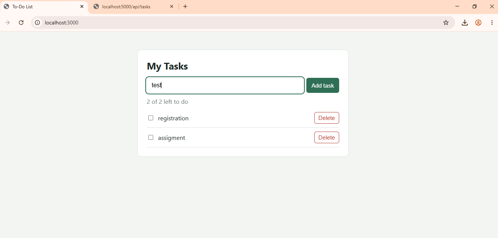
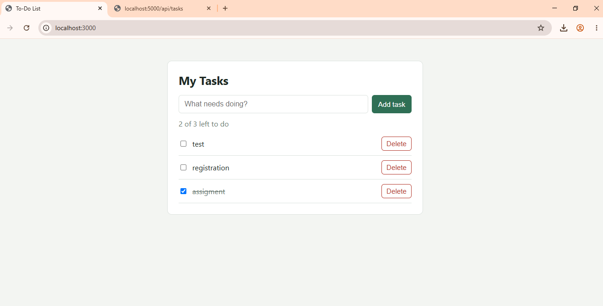
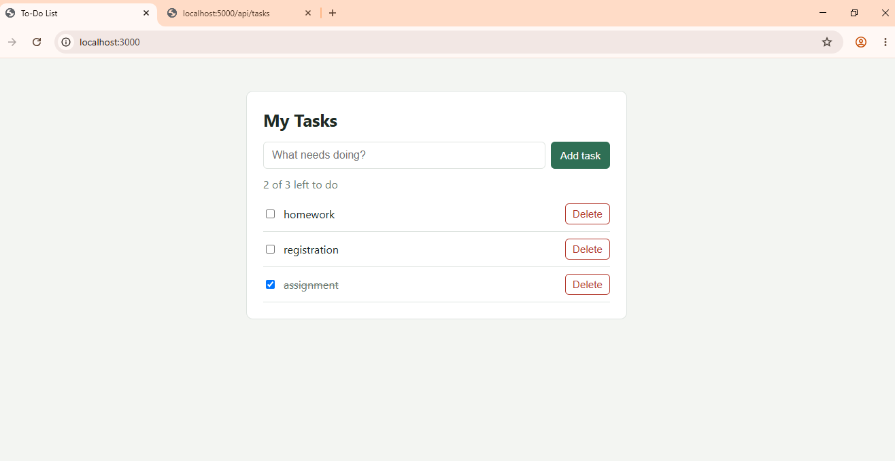
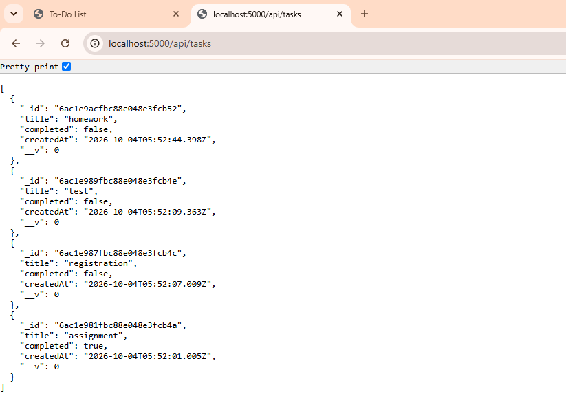

# MERN To-Do List

Full-stack To-Do List built with **MongoDB, Express, React and Node.js**.
Course: Web Technology — Assignment 2.

## Features
- Add, view, complete/uncomplete, edit (double-click a title) and delete tasks
- React frontend talks to an Express REST API; data is stored in MongoDB via Mongoose
- Screen updates without a page reload

## Project structure
```
todo-mern/
├── backend/
│   ├── models/Task.js        # Mongoose schema
│   ├── routes/tasks.js       # REST endpoints
│   ├── server.js             # Express app + DB connection
│   ├── .env.example          # Template for environment variables (committed)
│   └── .env                  # Real settings (created, NOT committed)
├── frontend/
│   ├── src/
│   │   ├── components/       # TaskForm, TaskItem
│   │   ├── api.js            # fetch calls to the backend
│   │   └── App.jsx
│   └── vite.config.js        # dev proxy: /api -> http://localhost:5000
├── screenshots/
└── .gitignore                # keeps node_modules and .env out of Git
```

## Prerequisites
- Node.js 18+
- MongoDB running locally (`mongodb://127.0.0.1:27017`) **or** a free MongoDB Atlas cluster

## Environment variables
The backend reads its settings from a `.env` file in the `backend/` folder.
This file is **not included in the repository** because it can contain a database password.
Create it by copying the template:

```bash
cd backend
cp .env.example .env        # Windows (cmd): copy .env.example .env
```

| Variable | Description | Example |
| --- | --- | --- |
| `PORT` | Port the API runs on | `5000` |
| `MONGO_URI` | MongoDB connection string | see below |

**Local MongoDB**
```
PORT=5000
MONGO_URI=mongodb://127.0.0.1:27017/todo_app
```

**MongoDB Atlas**
```
PORT=5000
MONGO_URI=mongodb+srv://<username>:<password>@<cluster>.mongodb.net/todo_app
```
Use your **database user's** username and password (from Atlas → Database Access).
Replace `<password>` without the angle brackets, and avoid special characters in the password.
In Atlas → Network Access, allow your IP address (or `0.0.0.0/0` for testing).

The database and collection are created automatically when the first task is added.

## How to run
Two terminals are needed, because the backend and frontend run separately.

### 1. Backend (terminal 1)
```bash
cd backend
npm install
# create .env first (see "Environment variables" above)
npm start                 # or: npm run dev   (auto-restart with nodemon)
```
Expected output:
```
MongoDB connected
Server running on http://localhost:5000
```

### 2. Frontend (terminal 2)
```bash
cd frontend
npm install
npm start
```
Open **http://localhost:3000**.

### How the two parts connect
- Frontend: `http://localhost:3000` (React, served by Vite)
- Backend API: `http://localhost:5000/api/tasks` (Express)
- The Vite dev server proxies every `/api` request to port 5000, so the React code simply calls `fetch('/api/tasks')`.

## API
| Method | Endpoint | Body | Description |
| --- | --- | --- | --- |
| GET | /api/tasks | – | Get all tasks |
| POST | /api/tasks | `{ "title": "..." }` | Create a task |
| PUT | /api/tasks/:id | `{ "title"?, "completed"? }` | Update a task |
| DELETE | /api/tasks/:id | – | Delete a task |

## Troubleshooting
- **`MongoDB connection failed: bad auth`**: wrong username or password in `MONGO_URI`. Check Atlas → Database Access, and make sure the `<password>` placeholder was replaced.
- **Backend exits immediately on a local setup**: MongoDB is not running. Start the MongoDB service and try again.
- **Page loads but tasks do not save**: the backend is not running. Keep both terminals open.
- **PowerShell: "running scripts is disabled"**: run `Set-ExecutionPolicy -Scope CurrentUser -ExecutionPolicy RemoteSigned`, or use Command Prompt instead.
- **`.env` changes have no effect**: restart the backend; `.env` is read only at startup.

## Screenshots
See the `screenshots/` folder (adding, completing and deleting a task).




